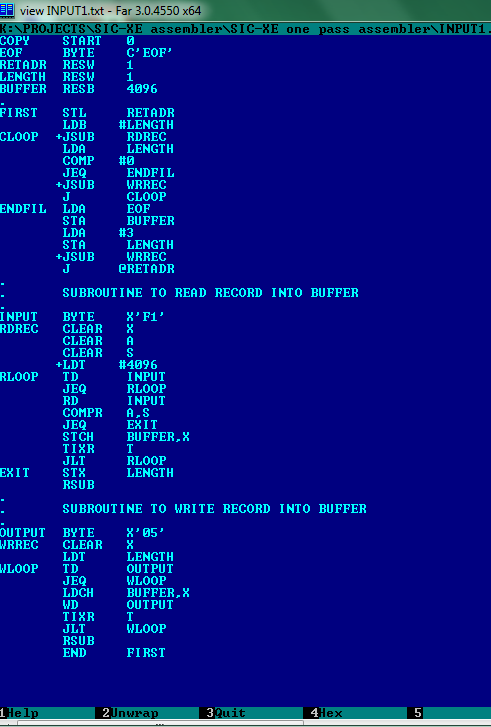
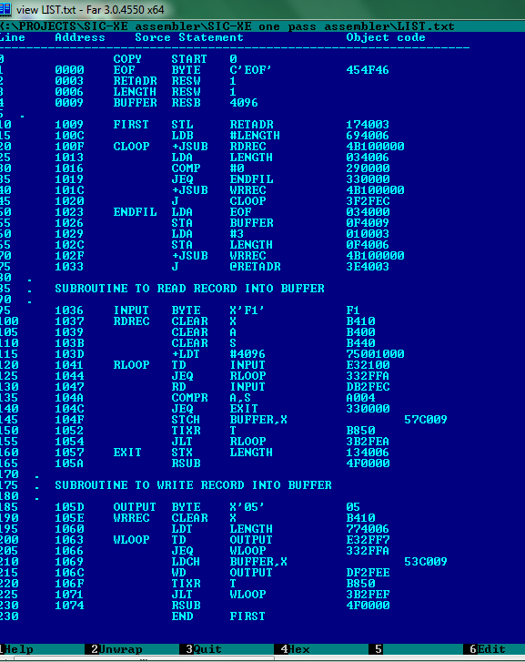
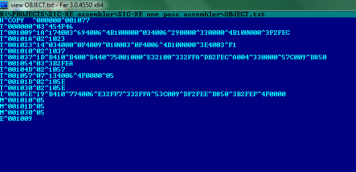

# SIC/XE single pass assembler

### converts SIC/XE machine assembly code to object code.

#### Instructions on how to use :

* Run the SIC.cpp file using any C++ compiler.

**Note : ** The current program takes assembly code in file INPUT1.txt as input.

* The LIST.txt contains the generated list of object code.
* The MODIFY.txt contains the modifications on the object code.
* The OBJECT.txt contains the final object code.

 
INPUT1.txt :  

 
LIST.txt :  

 
OBJECT.txt :  

